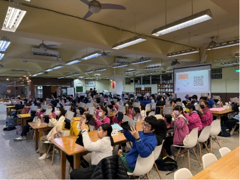
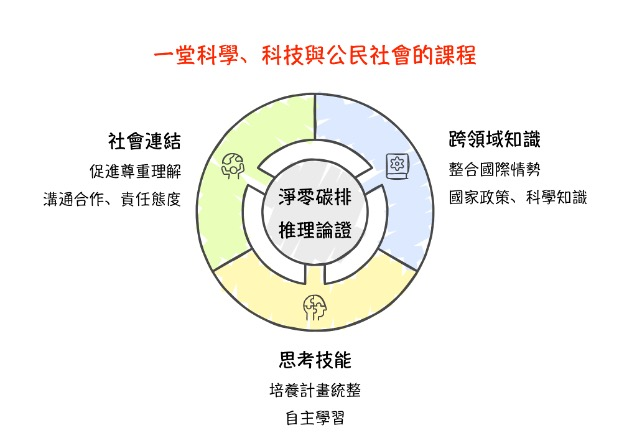
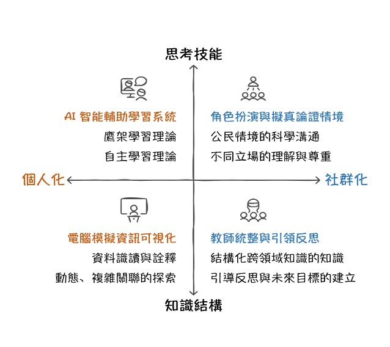
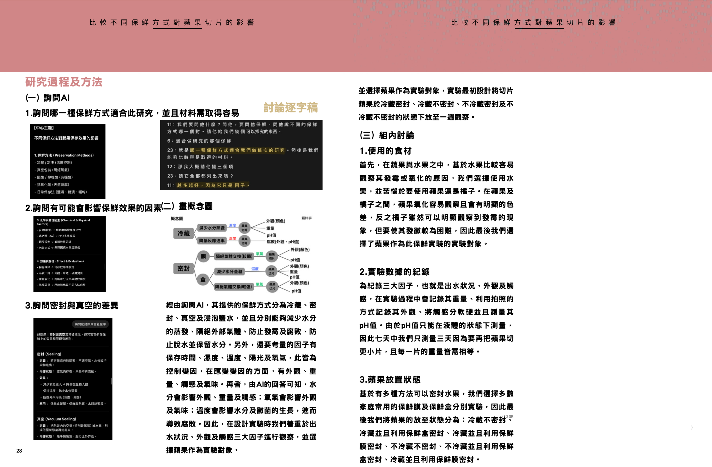

# AISI平台教學報告

## 第一頁：問題解決中的自主學習

AISI平台運用科技重新定義師生角色：學生成為學習主體，根據個人基礎主動調整學習方向與步調；教師轉為定向者，透過ThinkForge功能預設引導方向，讓AI提供個人化引導並確保達成教學目標。

此模式創新在於兼顧個人化學習彈性與教育系統性，學生享有自主學習自由度的同時，仍在教師專業引導下掌握關鍵學習點，建構完整知識體系。

---

## 第二頁：跨年齡支持架構

### 國小階段：情意培養與知識基礎建構

AISI平台的跨年齡支援能力是重要特色，針對不同學習階段提供差異化支援。國小學生雖具高學習動機與好奇心，但因經驗不足，缺乏即時適切回饋，且在自主學習能力初期培養階段，常不理解真正的學習。AISI如多元學習顧問，提供替代經驗與知識，引導學生社會化。

AISI團隊以「淨零碳排」為SDGs學習媒材，設計融合科學、科技與公民社會的自主學習課程。承襲108課綱「自發、互動、共好」精神，結合自主學習與鷹架理論，將淨零碳排論證拆解為四個維度：思考技能、個人化學習、社群化互動和知識結構建構。

---

## 第三頁：教學流程設計採用五階段模式

**第一階段：學生自學建立基礎**，透過雲端教室系統引入能源議題，要求學生選擇立場並說明理由，培養獨立思考與觀點表達能力。

**第二階段：教師導學**，透過圖像化說明引導學生理解高品質論述的要素，並指導AI學習平台的使用方法。

**第三階段：AI輔助個人化學習**，學生利用AI系統獲得即時回饋，發現論證不足並進行修正，透過自我對話強化論證能力。

**第四階段：組內共學**，學生透過麻省理工設計的電腦模擬進行資料收集與詮釋，與組員討論如何運用數據支持主張。

**第五階段：組間互學**，以角色扮演方式模擬政府、企業、環團、公民等不同立場，進行跨領域議題的深度辯論。

---

## 第四頁：高中階段：深化問題解決與實作能力

高中生雖具科學知識基礎，但缺乏動手操作機會，問題解決技能練習不足。即使學校提供探究實作機會，學生仍面臨不知如何開始、調整或評估問題解決效果等困境。

AISI內建科學探究聊天機器人，提供研究者楷模協助學生剖析問題結構。學生為有效互動必須培養問題意識與批判思考。有別於一般生成式AI單純獲取資訊，AISI探究實作課程鼓勵學生主動嘗試，親自體驗AI建議與自己想法差異，在評量新舊知識同時練習與科技互動，同步培養軟硬實力。

### 高中課程以開放性問題解決為核心

認知到真實世界的問題遠比紙本科學問題更加開放且複雜。整體探究過程包含問題定向、概念化、調查分析、結果呈現、溝通討論。

**教學流程包括：**

**第一階段：** 學生自學階段進行小組討論，觀察並分享日常中值得解決的科學問題

**第二階段：** 教師導學階段指導AI平台使用，引導學生思考成功問題解決的標準

**第三階段：** AI輔助自學階段提供個人化即時回饋，協助修正探究計畫

**第四階段：** 最終透過組內共學到組間互學，完成從個人研究到社群溝通的完整歷程。